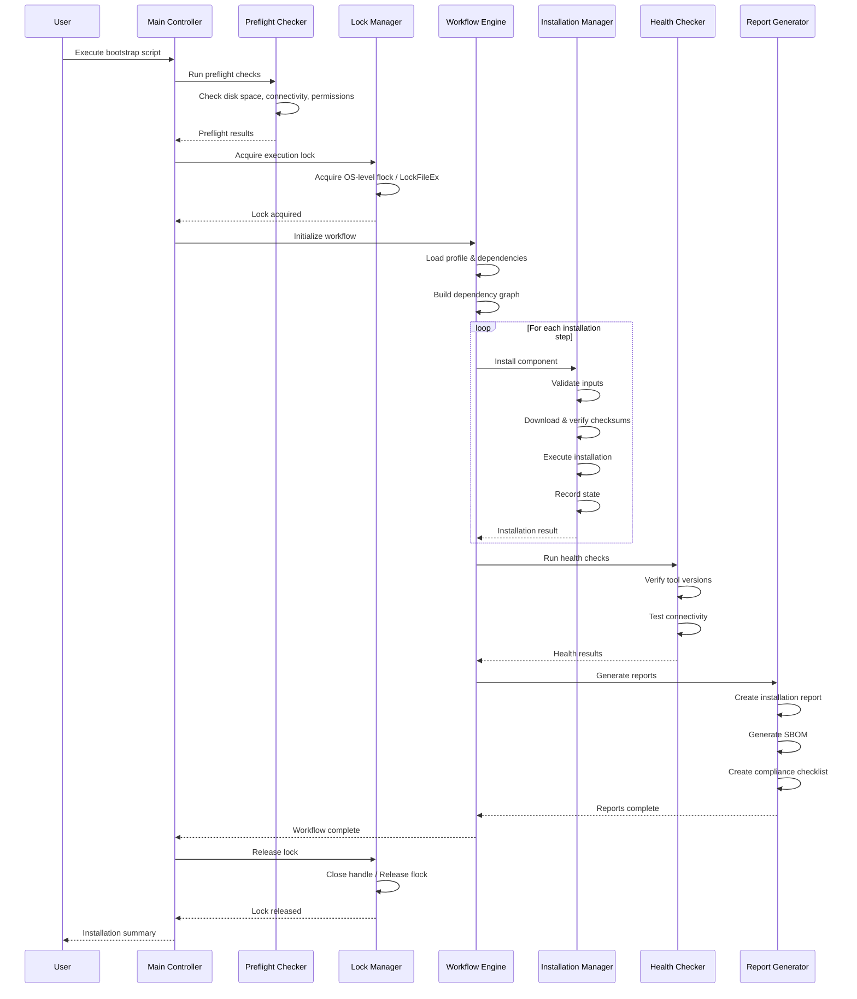

# Technical Design Document

## Overview

This document defines the technical architecture for transforming the dev-env-setup project from a simple bootstrap script into an enterprise-grade, production-ready infrastructure automation platform. The enhanced system will provide comprehensive security hardening, robust reliability mechanisms, cloud-native capabilities, and extensive observability features while maintaining the simplicity and user-friendliness of the original scripts.

### Design Goals

1. **Security First**: Implement defense-in-depth with input validation, secure credential storage, checksum verification, and comprehensive audit logging
2. **Reliability**: Ensure installation success through retry logic, rollback capabilities, health checks, and graceful degradation
3. **Observability**: Provide deep insights through structured logging, telemetry, metrics, and distributed tracing
4. **Modularity**: Design loosely-coupled components with clear interfaces for extensibility and maintainability
5. **Cross-Platform**: Maintain full compatibility across macOS, Linux (multiple distributions), Windows, and WSL2
6. **Developer Experience**: Deliver intuitive interfaces (CLI, TUI, configuration files) with excellent error messages and progress indicators
7. **Cloud-Native**: Support modern cloud and Kubernetes workflows with IaC tools, cloud CLIs, and service mesh tooling

### Key Technical Decisions

1. **Hybrid Architecture**: Core orchestration in Bash/PowerShell for maximum portability; complex components (security scanning, telemetry, TUI) in Go for performance and type safety
2. **Configuration Schema**: YAML primary format with JSON support; JSON Schema validation; configuration inheritance via `extends` field
3. **State Management**: Append-only state file with atomic operations; checksum-based integrity verification; separate audit log for compliance
4. **Plugin Architecture**: Hook-based plugin system with isolated execution; plugins as shell scripts or executables; signature verification required
5. **Telemetry Stack**: OpenTelemetry SDK for traces/metrics; optional Prometheus Pushgateway; respect privacy with opt-in only
6. **Testing Strategy**: Property-based testing (fast-check for parsers); container-based integration tests; matrix testing across OS versions

## Architecture

### High-Level Architecture

```mermaid
graph TB
    subgraph "User Interface Layer"
        CLI[CLI Parser]
        TUI[Interactive TUI]
        CONFIG[Config File Reader]
    end
    
    subgraph "Orchestration Layer"
        MAIN[Main Controller]
        PROFILE[Profile Manager]
        WORKFLOW[Workflow Engine]
    end
    
    subgraph "Core Services"
        INSTALL[Installation Manager]
        STATE[State Manager]
        LOCK[Lock Manager]
        ROLLBACK[Rollback Manager]
    end
    
    subgraph "Security Services"
        VALIDATOR[Input Validator]
        SECURITY[Security Scanner]
        CREDS[Credential Store]
        AUDIT[Audit Logger]
    end
    
    subgraph "Reliability Services"
        RETRY[Retry Handler]
        HEALTH[Health Checker]
        PREFLIGHT[Preflight Checker]
        VERSION[Version Checker]
    end
    
    subgraph "Observability Services"
        LOGGER[Structured Logger]
        TELEMETRY[Telemetry Collector]
        PROGRESS[Progress Indicator]
        REPORTER[Report Generator]
    end
    
    subgraph "Platform Services"
        ARCH[Architecture Detector]
        PROXY[Proxy Detector]
        WSL[WSL Detector]
        CLOUD[Cloud Environment Detector]
    end
    
    subgraph "Extension Layer"
        PLUGIN[Plugin Manager]
        UPDATE[Update Checker]
        SBOM[SBOM Generator]
    end
    
    CLI --> MAIN
    TUI --> MAIN
    CONFIG --> MAIN
    
    MAIN --> PROFILE
    MAIN --> WORKFLOW
    MAIN --> LOCK
    
    WORKFLOW --> INSTALL
    WORKFLOW --> STATE
    WORKFLOW --> ROLLBACK
    
    INSTALL --> SECURITY
    INSTALL --> RETRY
    INSTALL --> HEALTH
    
    MAIN --> VALIDATOR
    MAIN --> CREDS
    MAIN --> AUDIT
    
    MAIN --> PREFLIGHT
    MAIN --> VERSION
    
    MAIN --> LOGGER
    MAIN --> TELEMETRY
    MAIN --> PROGRESS
    MAIN --> REPORTER
    
    MAIN --> ARCH
    MAIN --> PROXY
    MAIN --> WSL
    MAIN --> CLOUD
    
    WORKFLOW --> PLUGIN
    MAIN --> UPDATE
    REPORTER --> SBOM
```



### Component Architecture

The system follows a layered architecture with clear separation of concerns:

1. **User Interface Layer**: Handles user input via CLI flags, interactive TUI, or configuration files
2. **Orchestration Layer**: Coordinates the installation workflow, manages profiles, and controls execution flow
3. **Core Services**: Provides fundamental capabilities (installation, state management, locking, rollback)
4. **Security Services**: Implements all security-related functionality (validation, scanning, credentials, audit)
5. **Reliability Services**: Ensures robustness (retries, health checks, preflight checks, version management)
6. **Observability Services**: Provides visibility (logging, telemetry, progress, reporting)
7. **Platform Services**: Detects and adapts to platform-specific characteristics
8. **Extension Layer**: Supports extensibility (plugins, updates, SBOM generation)

### Process Flow



## Components and Interfaces

### 1. Main Controller

**Responsibility**: Orchestrates the entire bootstrap process, coordinates all components, and manages the overall execution flow.

**Interface**:
```bash
# CLI Interface
./bootstrap.sh [OPTIONS]

Options:
  --config FILE                  Load configuration from YAML/JSON file
  --profile PROFILE              Installation profile (minimal|standard|full)
  --yes                          Non-interactive mode
  --dry-run                      Show planned actions without executing
  --interactive                  Launch interactive TUI
  --prefix DIR                   Custom installation directory
  --offline DIR                  Offline mode using local archives
  --enable-telemetry             Opt-in to telemetry collection
  --prometheus-pushgateway URL   Push metrics to Prometheus
  --otel-endpoint URL            Export traces to OpenTelemetry
  --json-log                     Output logs in JSON format
  --no-update-check              Disable update check
  --self-update                  Update bootstrap script
  --rollback STEP_ID             Rollback specific installation step
  --uninstall                    Uninstall all tools
  --clean                        Remove bootstrap artifacts only
  --cloud PROVIDER               Cloud tools (aws|azure|gcp|all)
  --prepare-offline DIR          Download archives for offline use
  --plugin-dir DIR               Custom plugin directory
  --show-dependencies            Display dependency graph
  --create-adr TITLE             Create Architecture Decision Record
```

**Configuration File Format**:
```yaml
# devsetup.yaml
version: "1.0"
extends: "base-config.yaml"  # Configuration inheritance

profile: "standard"
prefix: "/opt/devtools"

user:
  name: "Developer Name"
  email: "dev@example.com"
  github: "devuser"
  shell: "zsh"
  editor: "code"

tools:
  core:
    enabled: true
    required: true
  node:
    enabled: true
    version: "20.11.0"
  java:
    enabled: true
    version: "17"
  docker:
    enabled: true
    required: false
  cloud:
    enabled: true
    providers: ["aws", "azure"]
  kubernetes:
    enabled: true
    cluster_version: "1.29"

security:
  checksum_verification: true
  cve_scanning: true
  checksum_database_url: "https://example.com/checksums.json"

reliability:
  retry_attempts: 5
  retry_initial_delay: 1
  retry_max_delay: 60
  health_checks: true
  rollback_on_failure: true

observability:
  log_format: "json"
  telemetry: true
  prometheus_pushgateway: "https://pushgateway.example.com"
  otel_endpoint: "https://otel-collector.example.com"

compliance:
  audit_logging: true
  sbom_generation: true
  compliance_reporting: true

plugins:
  directory: "~/.devsetup/plugins"
  enabled: ["company-tools", "team-standards"]
```

### 2. Configuration Manager

**Responsibility**: Parses and validates configuration files, manages configuration inheritance, and provides configuration access to other components.

**API**:
```typescript
interface ConfigManager {
  // Load and validate configuration
  loadConfig(path: string): Result<Configuration>
  
  // Validate against JSON Schema
  validateSchema(config: Configuration): ValidationResult
  
  // Merge configurations (handle extends)
  mergeConfigs(base: Configuration, override: Configuration): Configuration
  
  // Export configuration
  exportConfig(config: Configuration, format: "yaml" | "json"): string
}

interface Configuration {
  version: string
  extends?: string
  profile: string
  prefix?: string
  user: UserConfig
  tools: ToolsConfig
  security: SecurityConfig
  reliability: ReliabilityConfig
  observability: ObservabilityConfig
  compliance: ComplianceConfig
  plugins: PluginsConfig
}
```

### 3. State Manager

**Responsibility**: Manages installation state, tracks completed steps, provides resumability, and ensures state file integrity.

**State File Format**:
```
# State file format: append-only, one entry per line
# Format: TIMESTAMP|STEP_ID|STATUS|CHECKSUM
2024-01-15T10:30:00Z|userinfo|complete|abc123def456
2024-01-15T10:31:00Z|core|complete|def456abc789
2024-01-15T10:35:00Z|node|complete|789abc123def
# EOF checksum: sha256sum of all lines above
# INTEGRITY:fedcba987654321
```

**API**:
```typescript
interface StateManager {
  // Check if step is complete
  isDone(stepId: string): boolean
  
  // Mark step as complete
  markDone(stepId: string): Result<void>
  
  // Get step metadata
  getStepInfo(stepId: string): StepInfo | null
  
  // Verify state file integrity
  verifyIntegrity(): Result<boolean>
  
  // Reset state for specific step
  resetStep(stepId: string): Result<void>
  
  // Export state to JSON
  exportState(): StateSnapshot
  
  // Import state from JSON
  importState(snapshot: StateSnapshot): Result<void>
}

interface StepInfo {
  stepId: string
  timestamp: Date
  status: "complete" | "failed" | "rollback"
  checksum: string
  metadata?: Record<string, any>
}
```

### 4. Installation Manager

**Responsibility**: Executes tool installations, manages downloads, coordinates with security scanning, and handles installation failures.

**API**:
```typescript
interface InstallationManager {
  // Install a single tool
  installTool(tool: ToolSpec): InstallResult
  
  // Install multiple tools in order
  installTools(tools: ToolSpec[]): InstallResults
  
  // Download artifact
  downloadArtifact(url: string, dest: string): DownloadResult
  
  // Extract archive
  extractArchive(path: string, dest: string): Result<void>
  
  // Execute installation command
  executeInstall(command: string, env: Environment): Result<CommandOutput>
}

interface ToolSpec {
  id: string
  name: string
  version?: string
  required: boolean
  platform: Platform[]
  arch: Architecture[]
  downloadUrl?: string
  checksum?: string
  installCommand: string
  verifyCommand: string
  dependencies: string[]
}

interface InstallResult {
  success: boolean
  toolId: string
  version: string
  installedPath: string
  duration: number
  errors?: string[]
}
```

### 5. Security Scanner

**Responsibility**: Performs checksum verification, CVE scanning, validates downloads, and manages the checksum database.

**Checksum Database Format**:
```json
{
  "version": "1.0",
  "last_updated": "2024-01-15T10:00:00Z",
  "signature": "base64-encoded-signature",
  "checksums": {
    "node-v20.11.0-linux-x64": {
      "sha256": "abcdef123456...",
      "sha512": "fedcba654321...",
      "url": "https://nodejs.org/dist/v20.11.0/node-v20.11.0-linux-x64.tar.gz",
      "size": 22581792
    },
    "kubectl-v1.29.0-linux-amd64": {
      "sha256": "123456abcdef...",
      "sha512": "654321fedcba...",
      "url": "https://dl.k8s.io/release/v1.29.0/bin/linux/amd64/kubectl",
      "size": 49778688
    }
  }
}
```

**API**:
```typescript
interface SecurityScanner {
  // Verify artifact checksum
  verifyChecksum(path: string, expected: string, algorithm: "sha256" | "sha512"): Result<boolean>
  
  // Compute file checksum
  computeChecksum(path: string, algorithm: "sha256" | "sha512"): Result<string>
  
  // Query CVE database
  queryCVEs(tool: string, version: string): CVEResult[]
  
  // Load checksum database
  loadChecksumDatabase(url: string): Result<ChecksumDatabase>
  
  // Verify database signature
  verifyDatabaseSignature(database: ChecksumDatabase, publicKey: string): Result<boolean>
}

interface CVEResult {
  cveId: string
  severity: "critical" | "high" | "medium" | "low"
  description: string
  affectedVersions: string[]
  patchedVersion?: string
  references: string[]
}
```

### 6. Credential Store

**Responsibility**: Securely stores and retrieves credentials using OS-native secure storage mechanisms.

**API**:
```typescript
interface CredentialStore {
  // Store credential
  store(service: string, account: string, secret: string): Result<void>
  
  // Retrieve credential
  retrieve(service: string, account: string): Result<string>
  
  // Delete credential
  delete(service: string, account: string): Result<void>
  
  // List stored credentials (without secrets)
  list(): CredentialMetadata[]
}

interface CredentialMetadata {
  service: string
  account: string
  createdAt: Date
  lastAccessed: Date
}
```

**Implementation Strategy**:
- **macOS**: Use `security` command to interact with Keychain
- **Linux**: Use `libsecret` (Secret Service API) or fallback to encrypted file with `gpg`
- **Windows**: Use `cmdkey` to interact with Credential Manager

### 7. Retry Handler

**Responsibility**: Implements exponential backoff retry logic for network operations and transient failures.

**API**:
```typescript
interface RetryHandler {
  // Execute operation with retry
  executeWithRetry<T>(
    operation: () => Promise<T>,
    config: RetryConfig
  ): Promise<T>
  
  // Execute with custom backoff strategy
  executeWithBackoff<T>(
    operation: () => Promise<T>,
    backoff: BackoffStrategy
  ): Promise<T>
}

interface RetryConfig {
  maxAttempts: number
  initialDelay: number  // milliseconds
  maxDelay: number      // milliseconds
  backoffMultiplier: number  // default 2.0
  retryableErrors: ErrorMatcher[]
}

interface BackoffStrategy {
  nextDelay(attempt: number): number
  shouldRetry(error: Error, attempt: number): boolean
}
```

### 8. Health Checker

**Responsibility**: Verifies installed tools are functional, tests connectivity, and generates health reports.

**API**:
```typescript
interface HealthChecker {
  // Check single tool health
  checkTool(toolId: string): HealthResult
  
  // Check all installed tools
  checkAll(): HealthReport
  
  // Verify service connectivity
  checkService(service: ServiceSpec): ConnectivityResult
}

interface HealthResult {
  toolId: string
  healthy: boolean
  version: string
  executablePath: string
  responseTime: number
  errors?: string[]
}

interface HealthReport {
  timestamp: Date
  overallStatus: "healthy" | "degraded" | "unhealthy"
  toolResults: HealthResult[]
  summary: {
    total: number
    healthy: number
    unhealthy: number
  }
}
```

### 9. Telemetry Collector

**Responsibility**: Collects opt-in telemetry, exports metrics and traces to observability backends.

**API**:
```typescript
interface TelemetryCollector {
  // Record metric
  recordMetric(name: string, value: number, labels: Labels): void
  
  // Start span
  startSpan(name: string, attributes: Attributes): Span
  
  // Push to Prometheus
  pushToPrometheus(gateway: string): Result<void>
  
  // Export to OpenTelemetry
  exportToOTel(endpoint: string): Result<void>
}

interface Span {
  end(): void
  setStatus(status: "ok" | "error"): void
  addEvent(name: string, attributes: Attributes): void
}
```

**Metrics**:
- `devsetup_installation_duration_seconds` (histogram)
- `devsetup_tool_install_count` (counter)
- `devsetup_installation_failures` (counter)
- `devsetup_download_bytes` (counter)
- `devsetup_health_check_status` (gauge)

### 10. Plugin Manager

**Responsibility**: Discovers, loads, validates, and executes plugins; manages plugin lifecycle hooks.

**Plugin Interface**:
```bash
# Plugin must implement these hooks (all optional)
pre_install()   # Called before installation starts
post_install()  # Called after installation completes
pre_verify()    # Called before health checks
post_verify()   # Called after health checks
```

**Plugin Metadata** (`plugin.yaml`):
```yaml
name: "company-tools"
version: "1.0.0"
description: "Company-specific development tools"
author: "Platform Team"
signature: "base64-encoded-signature"

hooks:
  - pre_install
  - post_install

dependencies:
  - core
  - node

tools:
  - id: "internal-cli"
    name: "Internal CLI Tool"
    version: "2.5.0"
    downloadUrl: "https://internal.example.com/cli/v2.5.0/cli.tar.gz"
    checksum: "sha256:abcdef123456..."
    installCommand: "tar -xzf cli.tar.gz && mv cli /usr/local/bin/"
    verifyCommand: "cli --version"
```

**API**:
```typescript
interface PluginManager {
  // Discover plugins in directory
  discoverPlugins(directory: string): Plugin[]
  
  // Load and validate plugin
  loadPlugin(path: string): Result<Plugin>
  
  // Verify plugin signature
  verifySignature(plugin: Plugin, publicKey: string): Result<boolean>
  
  // Execute plugin hook
  executeHook(plugin: Plugin, hook: string, context: Context): Result<void>
}
```

## Data Models

### Core Domain Models

```typescript
// User configuration
interface UserConfig {
  name: string
  email: string
  github: string
  shell: "bash" | "zsh" | "fish"
  editor: "vim" | "nano" | "code" | "emacs"
}

// Tool configuration
interface ToolConfig {
  id: string
  enabled: boolean
  version?: string
  required: boolean
  customOptions?: Record<string, any>
}

// Installation profile
interface InstallationProfile {
  id: string
  name: string
  description: string
  tools: string[]  // Tool IDs
  estimatedDiskSpace: number  // bytes
  estimatedTime: number  // seconds
}

// System information
interface SystemInfo {
  os: "darwin" | "linux" | "windows"
  osVersion: string
  arch: "x86_64" | "arm64" | "i686"
  isWSL: boolean
  isCloudVM: boolean
  cloudProvider?: "aws" | "azure" | "gcp"
  availableDisk: number
  totalDisk: number
  availableMemory: number
  totalMemory: number
}

// Download artifact
interface Artifact {
  url: string
  filename: string
  checksum: string
  checksumAlgorithm: "sha256" | "sha512"
  size: number
  destination: string
}

// Execution result
interface ExecutionResult {
  success: boolean
  exitCode: number
  stdout: string
  stderr: string
  duration: number
  timestamp: Date
}

// Audit log entry
interface AuditEntry {
  timestamp: Date
  level: "INFO" | "WARN" | "ERROR" | "CRITICAL"
  eventType: string
  actor: string
  action: string
  resource: string
  result: "success" | "failure"
  metadata?: Record<string, any>
}
```

### Configuration Schema

```json
{
  "$schema": "http://json-schema.org/draft-07/schema#",
  "title": "DevSetup Configuration",
  "type": "object",
  "required": ["version", "profile"],
  "properties": {
    "version": {
      "type": "string",
      "pattern": "^[0-9]+\\.[0-9]+$"
    },
    "extends": {
      "type": "string",
      "description": "Path to base configuration file"
    },
    "profile": {
      "type": "string",
      "enum": ["minimal", "standard", "full"]
    },
    "prefix": {
      "type": "string",
      "description": "Custom installation directory"
    },
    "user": {
      "type": "object",
      "required": ["name", "email", "github"],
      "properties": {
        "name": {"type": "string", "minLength": 1},
        "email": {"type": "string", "format": "email"},
        "github": {"type": "string", "pattern": "^[a-zA-Z0-9-]+$"},
        "shell": {"type": "string", "enum": ["bash", "zsh", "fish"]},
        "editor": {"type": "string", "enum": ["vim", "nano", "code", "emacs"]}
      }
    },
    "tools": {
      "type": "object",
      "properties": {
        "core": {"$ref": "#/definitions/toolConfig"},
        "node": {"$ref": "#/definitions/toolConfig"},
        "java": {"$ref": "#/definitions/toolConfig"},
        "docker": {"$ref": "#/definitions/toolConfig"},
        "cloud": {
          "type": "object",
          "properties": {
            "enabled": {"type": "boolean"},
            "providers": {
              "type": "array",
              "items": {"type": "string", "enum": ["aws", "azure", "gcp"]}
            }
          }
        },
        "kubernetes": {
          "type": "object",
          "properties": {
            "enabled": {"type": "boolean"},
            "cluster_version": {"type": "string"}
          }
        }
      }
    },
    "security": {
      "type": "object",
      "properties": {
        "checksum_verification": {"type": "boolean"},
        "cve_scanning": {"type": "boolean"},
        "checksum_database_url": {"type": "string", "format": "uri"}
      }
    },
    "reliability": {
      "type": "object",
      "properties": {
        "retry_attempts": {"type": "integer", "minimum": 1, "maximum": 10},
        "retry_initial_delay": {"type": "integer", "minimum": 1},
        "retry_max_delay": {"type": "integer", "minimum": 1},
        "health_checks": {"type": "boolean"},
        "rollback_on_failure": {"type": "boolean"}
      }
    },
    "observability": {
      "type": "object",
      "properties": {
        "log_format": {"type": "string", "enum": ["text", "json"]},
        "telemetry": {"type": "boolean"},
        "prometheus_pushgateway": {"type": "string", "format": "uri"},
        "otel_endpoint": {"type": "string", "format": "uri"}
      }
    }
  },
  "definitions": {
    "toolConfig": {
      "type": "object",
      "properties": {
        "enabled": {"type": "boolean"},
        "version": {"type": "string"},
        "required": {"type": "boolean"},
        "customOptions": {"type": "object"}
      }
    }
  }
}
```

## Error Handling

### Error Hierarchy

```typescript
// Base error type
interface DevSetupError {
  code: string
  message: string
  remediation: string
  severity: "fatal" | "error" | "warning"
  metadata?: Record<string, any>
}

// Error categories
type NetworkError = DevSetupError & { code: "NET_*" }
type PermissionError = DevSetupError & { code: "PERM_*" }
type DiskSpaceError = DevSetupError & { code: "DISK_*" }
type ValidationError = DevSetupError & { code: "VAL_*" }
type SecurityError = DevSetupError & { code: "SEC_*" }
type InstallationError = DevSetupError & { code: "INST_*" }
```

### Error Codes and Remediation

| Error Code | Message | Remediation |
|------------|---------|-------------|
| NET_TIMEOUT | Network request timed out | Check internet connectivity, VPN status, and proxy settings |
| NET_DNS_FAIL | DNS resolution failed | Verify DNS configuration, try alternative DNS servers |
| NET_PROXY_AUTH | Proxy authentication failed | Check proxy credentials, use --proxy-user and --proxy-pass flags |
| PERM_SUDO | Insufficient privileges | Run with sudo or ensure user has required permissions |
| PERM_FILE | Cannot write to file | Check file permissions and ownership |
| DISK_FULL | Insufficient disk space | Free up at least 10GB disk space or specify --prefix to alternative location |
| VAL_INPUT | Invalid input provided | Review input format, avoid special characters |
| VAL_CONFIG | Invalid configuration | Validate configuration against schema using --validate-config |
| SEC_CHECKSUM | Checksum verification failed | Re-download the artifact or check for supply chain attacks |
| SEC_CVE | Critical CVE detected | Update to patched version or acknowledge risk with --ignore-cve |
| SEC_SIGNATURE | Signature verification failed | Verify authenticity of source, do not proceed if suspicious |
| INST_FAIL | Installation command failed | Check logs for details, verify prerequisites |
| INST_CONFLICT | Version conflict detected | Uninstall conflicting version or use version manager |

### Retry Strategy

**Retryable Errors**: Network timeouts, DNS failures, temporary file locks, rate limiting
**Non-Retryable Errors**: Permission errors, disk full, checksum mismatches, configuration errors

**Exponential Backoff Algorithm**:
```
delay = min(initial_delay * (multiplier ^ attempt), max_delay)
jitter = random(0, delay * 0.1)
actual_delay = delay + jitter
```

**Example**:
- Attempt 1: 1s + jitter
- Attempt 2: 2s + jitter
- Attempt 3: 4s + jitter
- Attempt 4: 8s + jitter
- Attempt 5: 16s + jitter
- Attempt 6: 32s + jitter
- Attempt 7: 60s (capped) + jitter

### Rollback Strategy

**Rollback Triggers**:
1. Critical installation failure (required component)
2. Failed health check
3. User cancellation
4. Manual rollback request

**Rollback Process**:
1. Stop current operation
2. Read rollback state from StateManager
3. For each step in reverse order:
   - Remove installed files
   - Restore original configuration
   - Revert environment changes
4. Update state file to remove rolled-back steps
5. Log all rollback actions to audit log

**Rollback State Format**:
```json
{
  "stepId": "node",
  "timestamp": "2024-01-15T10:35:00Z",
  "preInstallSnapshot": {
    "installedFiles": [],
    "modifiedFiles": {
      "/home/user/.bashrc": "sha256:abc123...",
      "/home/user/.profile": "sha256:def456..."
    },
    "environmentVars": {
      "PATH": "/usr/bin:/bin",
      "NODE_PATH": ""
    }
  },
  "postInstallSnapshot": {
    "installedFiles": [
      "/usr/local/bin/node",
      "/usr/local/bin/npm",
      "/usr/local/lib/node_modules"
    ],
    "modifiedFiles": {
      "/home/user/.bashrc": "sha256:xyz789...",
      "/home/user/.profile": "sha256:uvw012..."
    },
    "environmentVars": {
      "PATH": "/usr/local/bin:/usr/bin:/bin",
      "NODE_PATH": "/usr/local/lib/node_modules"
    }
  }
}
```


## Testing Strategy

### Overview

The dev-env-setup-enhancements project employs a multi-layered testing approach combining property-based testing for parsers and data transformations, example-based unit tests for specific behaviors, integration tests for system interactions, and container-based end-to-end tests for cross-platform validation.

### PBT Applicability Assessment

**Property-Based Testing IS Appropriate For**:
- **Parser implementations** (Requirements 47-50): Configuration, State File, Log, and Checksum Database parsers
- **Data transformations**: Round-trip serialization/deserialization
- **Validation logic**: Schema validation with generated valid/invalid inputs
- **Filter operations**: Log filtering, tool selection

**Property-Based Testing IS NOT Appropriate For**:
- **Infrastructure operations** (Requirements 1-46): Tool installations, system configuration, security scanning
- **Side-effect operations**: File downloads, credential storage, service installations
- **External service interactions**: Package manager operations, cloud API calls
- **UI rendering**: TUI display, progress indicators
- **One-shot operations**: Preflight checks, lock file creation

The majority of requirements (1-46) deal with infrastructure automation, which is analogous to Infrastructure-as-Code. For these requirements, we use:
- **Example-based unit tests**: For specific scenarios and edge cases
- **Integration tests**: For verifying tool installations and system interactions
- **Container-based tests**: For cross-platform validation
- **Mock-based tests**: For testing logic without side effects

Only requirements 47-50 (parser implementations) are suitable for property-based testing with round-trip properties.

### Testing Strategy by Requirement Category

#### 1. Security Requirements (1-6)
**Testing Approach**: Example-based unit tests + integration tests
- Input validation: Test with known malicious inputs (shell metacharacters, path traversal)
- Credential handling: Verify secrets are masked in logs (mock keychain operations)
- Checksum verification: Test with known checksums and tampered files
- CVE scanning: Mock CVE database responses
- Audit logging: Verify log entries for security events

#### 2. Reliability Requirements (7-11)
**Testing Approach**: Example-based unit tests + chaos testing
- Retry logic: Simulate network failures, verify exponential backoff
- Graceful degradation: Test with failing optional components
- Preflight checks: Mock system state (disk space, permissions)
- Rollback: Verify state restoration after failures
- Error messages: Verify actionable remediation in error output

#### 3. Edge Cases (12-18)
**Testing Approach**: Example-based unit tests + platform-specific integration tests
- Proxy detection: Mock proxy configurations
- Offline mode: Test with local archives
- Version conflicts: Mock existing installations
- Multi-architecture: Test on ARM64 and x86_64 containers
- WSL2 detection: Test in WSL2 environment
- Concurrent execution: Test with simulated concurrent processes

#### 4. Observability (19-23)
**Testing Approach**: Example-based unit tests + mock backend integration
- Structured logging: Verify JSON log format
- Telemetry: Verify metrics collection (mock exporters)
- Health checks: Verify tool verification commands
- Prometheus/OTel: Mock push gateways and collectors
- Alerting: Verify alert triggers and deduplication

#### 5. DevOps Practices (24-30)
**Testing Approach**: Integration tests + container-based matrix testing
- Configuration files: See Correctness Properties (Requirement 47)
- Profiles: Verify tool selection for each profile
- Container testing: Run in multiple OS containers
- Integration tests: CI/CD pipeline execution
- Version pinning: Verify exact versions installed
- Dependency graphs: Verify DAG correctness, detect cycles

#### 6. Cloud-Native (31-35)
**Testing Approach**: Integration tests with mocked cloud APIs
- Cloud CLIs: Verify installations, mock authentication
- Kubernetes tools: Verify kubectl/helm installations
- IaC tools: Verify terraform/pulumi installations
- Service mesh: Verify istioctl/linkerd installations
- Cloud optimizations: Mock cloud VM metadata

#### 7. Developer Experience (36-41)
**Testing Approach**: Example-based unit tests + manual testing
- Progress indicators: Verify time estimates and updates
- TUI: Manual testing + snapshot tests
- Dry-run mode: Verify no side effects occur
- Uninstall: Verify cleanup completeness
- Update checker: Mock GitHub API responses
- Plugin system: Test plugin loading and execution

#### 8. Documentation & Compliance (42-46)
**Testing Approach**: Example-based unit tests + schema validation
- Installation reports: Verify report completeness
- Compliance checklists: Verify control mappings
- Troubleshooting runbooks: Verify content generation
- ADRs: Verify format compliance
- SBOM generation: See Correctness Properties (Requirement 46)

#### 9. Parsers & Data Formats (47-50)
**Testing Approach**: Property-based testing with round-trip properties
- See Correctness Properties section below

### Testing Technology Stack

**Property-Based Testing**:
- **JavaScript/TypeScript**: fast-check (for any helper scripts or Node-based tooling)
- **Python**: Hypothesis (if Python components are implemented)
- **Go**: gopter or rapid (for Go-based components like TUI, security scanner)

**Unit Testing**:
- **Bash**: bats-core (Bash Automated Testing System)
- **PowerShell**: Pester
- **Go**: standard testing package + testify

**Integration Testing**:
- **Container Testing**: Docker + test matrices (Ubuntu 20.04, 22.04, 24.04, Debian, Fedora, Alpine, macOS via Docker Desktop)
- **CI/CD**: GitHub Actions with matrix strategy

**Static Analysis**:
- **Bash**: ShellCheck
- **PowerShell**: PSScriptAnalyzer
- **Go**: golangci-lint

### Test Execution Strategy

**Unit Tests**: Run on every commit, < 30 seconds total execution time
**Property Tests**: Run on every commit, minimum 100 iterations per property, < 2 minutes total
**Integration Tests**: Run on every PR and main branch commit, matrix across OS versions
**Container Tests**: Run on every PR, parallel execution across containers
**Security Scans**: Run on every PR, fail on high/critical findings

### Property Test Configuration

All property-based tests MUST:
- Run minimum 100 iterations (to provide sufficient coverage of input space)
- Include shrinking to find minimal failing examples
- Tag tests with comments referencing design properties
- Use tag format: `// Feature: dev-env-setup-enhancements, Property {number}: {property_text}`

Example property test structure:
```javascript
// Feature: dev-env-setup-enhancements, Property 1: Configuration round-trip
test('configuration round-trip preserves data', () => {
  fc.assert(
    fc.property(
      arbitraryConfiguration(),
      (config) => {
        const yaml = printYAML(config);
        const parsed = parseYAML(yaml);
        expect(parsed).toEqual(config);
      }
    ),
    { numRuns: 100 }
  );
});
```

## Correctness Properties

*A property is a characteristic or behavior that should hold true across all valid executions of a system—essentially, a formal statement about what the system should do. Properties serve as the bridge between human-readable specifications and machine-verifiable correctness guarantees.*

The dev-env-setup-enhancements project implements property-based testing specifically for parser components (Requirements 47-50). The remaining requirements (1-46) involve infrastructure automation, external service interactions, and side-effect operations that are not suitable for property-based testing.

### Property 1: Configuration YAML Round-Trip Preserves Data

*For any* valid Configuration object, printing to YAML then parsing back SHALL produce an equivalent Configuration object.

**Validates: Requirements 47.6**

**Rationale**: YAML serialization and parsing must be inverse operations. This ensures configuration data is not lost or corrupted during save/load cycles.

### Property 2: Configuration JSON Round-Trip Preserves Data

*For any* valid Configuration object, printing to JSON then parsing back SHALL produce an equivalent Configuration object.

**Validates: Requirements 47.6**

**Rationale**: JSON serialization and parsing must be inverse operations. This ensures configuration data is preserved across different serialization formats.

### Property 3: Configuration Inheritance Merges Correctly

*For any* valid base Configuration and override Configuration, merging them then validating SHALL preserve override values while maintaining non-overridden base values.

**Validates: Requirements 24.5**

**Rationale**: Configuration inheritance via the `extends` field must correctly merge configurations, with child values taking precedence over parent values for specified fields.

### Property 4: Schema Validation Accepts Valid Configurations

*For any* Configuration object generated according to the JSON Schema, schema validation SHALL return success.

**Validates: Requirement 47.2**

**Rationale**: Valid configurations must pass schema validation. Generators that produce schema-compliant configurations should never fail validation.

### Property 5: Schema Validation Rejects Invalid Configurations

*For any* Configuration object that violates the JSON Schema, schema validation SHALL return failure with error details.

**Validates: Requirement 47.2**

**Rationale**: Invalid configurations must be caught by schema validation. Mutating valid configurations to violate schema constraints should always result in validation failure.

### Property 6: State File Round-Trip Preserves Checkpoints

*For any* valid State object, formatting as state file lines then parsing back SHALL produce an equivalent State object.

**Validates: Requirement 48.6**

**Rationale**: State file serialization must preserve all checkpoint information for resumability. Data loss in state files could cause duplicate installations or missed steps.

### Property 7: State File Integrity Verification

*For any* valid State file, computing its integrity checksum then verifying SHALL succeed; *for any* State file with modified content (without updating checksum), verification SHALL fail.

**Validates: Requirement 48.2**

**Rationale**: Integrity verification must detect tampering. Valid state files should pass verification, while any modification without checksum update should be detected.

### Property 8: Log Entry Round-Trip Preserves Data

*For any* valid Log entry, formatting as JSON then parsing back SHALL produce an equivalent Log entry.

**Validates: Requirement 49.6**

**Rationale**: Structured JSON logging must preserve all log entry fields. This ensures log analysis tools can reliably extract information from log files.

### Property 9: Log Entry Text Format Round-Trip Preserves Semantics

*For any* valid Log entry, formatting as plain text then parsing back SHALL extract the same timestamp, level, message, and component.

**Validates: Requirement 49.6, 49.2**

**Rationale**: Plain text log parsing must correctly extract structured information even though format is less strict than JSON. Key fields must survive round-trip.

### Property 10: Log Filtering Returns Matching Entries Only

*For any* collection of Log entries and any filter criteria (severity, component, time range), the filtered result SHALL contain only entries matching all criteria.

**Validates: Requirement 49.4**

**Rationale**: Log filtering must correctly implement predicate logic. No non-matching entries should appear in results, and all matching entries should be included.

### Property 11: Checksum Database Round-Trip Preserves All Entries

*For any* valid Checksum_Database object, printing to JSON then parsing back SHALL produce an equivalent object with all checksum entries preserved.

**Validates: Requirement 50.6**

**Rationale**: Checksum database serialization must not lose any checksum entries. Each entry contains critical security information for artifact verification.

### Property 12: Checksum Computation Is Deterministic

*For any* artifact file and checksum algorithm (SHA-256, SHA-512), computing the checksum multiple times SHALL produce identical results.

**Validates: Requirement 50.4**

**Rationale**: Checksum computation must be deterministic. The same file should always produce the same checksum for a given algorithm.

### Property 13: SBOM Round-Trip Preserves Component Information

*For any* valid SBOM object (SPDX or CycloneDX format), printing to JSON/YAML then parsing back SHALL produce an equivalent object with all components and dependencies preserved.

**Validates: Requirement 46.6, 46.7**

**Rationale**: SBOM serialization must preserve complete software bill of materials data including package names, versions, licenses, checksums, and dependency relationships.

## Property Reflection

After reviewing all identified properties, the following analysis confirms no redundancy:

1. **Properties 1 & 2** (Configuration YAML/JSON round-trip): These test different serialization formats and cannot be combined. Both formats must be supported independently.

2. **Properties 6 & 7** (State file round-trip vs integrity): Property 6 tests data preservation through serialization. Property 7 tests tampering detection. These are distinct security properties.

3. **Properties 8 & 9** (Log JSON vs text round-trip): These test different log formats with different preservation guarantees (JSON preserves all fields, text preserves key fields). Both are necessary.

4. **Properties 11 & 13** (Checksum DB vs SBOM round-trip): These are different data structures serving different purposes (security verification vs compliance). Cannot be combined.

All 13 properties provide unique validation value and should be retained.


## Implementation Considerations

### Technology Selection

#### Core Orchestration: Bash + PowerShell

**Rationale**: 
- Maximum portability - Bash available on all Unix-like systems, PowerShell on Windows
- No additional runtime dependencies
- Direct system interaction without abstraction layers
- Existing bootstrap scripts already implemented in these languages

**Trade-offs**:
- Limited type safety
- Challenging error handling
- String-heavy programming model
- Difficult to test complex logic

**Mitigation**:
- Extract complex logic into separate helper programs (Go)
- Use strict error handling (`set -euo pipefail` in Bash)
- Comprehensive linting (ShellCheck, PSScriptAnalyzer)
- Modular design with clear component boundaries

#### Helper Programs: Go

**Rationale**:
- Single-binary deployment (no runtime dependencies)
- Excellent cross-platform support with native compilation
- Strong type safety and error handling
- Good performance for intensive operations
- Rich ecosystem for security, networking, and telemetry

**Use Cases**:
- Security Scanner (checksum verification, CVE queries)
- Telemetry Collector (OpenTelemetry SDK)
- TUI (bubble tea framework)
- Configuration validator (JSON Schema validation)
- Log parser and analyzer
- SBOM generator

**Alternative Considered**: Python
- **Pros**: Rich library ecosystem, easier to write
- **Cons**: Requires Python runtime (chicken-and-egg for bootstrap), slower execution, deployment complexity
- **Decision**: Go preferred for helper programs; Python acceptable for development/testing tools

#### Configuration Format: YAML (primary) + JSON (supported)

**Rationale**:
- YAML: Human-readable, comments support, widely used in DevOps
- JSON: Machine-readable, strict parsing, programming language friendly
- Both formats interoperable via common data model

**Schema Validation**: JSON Schema (supports both YAML and JSON)

#### State Management: Append-Only Text File

**Rationale**:
- Simple and debuggable (human-readable text)
- Atomic appends on Unix systems
- Easy to parse and query
- Minimal dependencies

**Format**:
```
TIMESTAMP|STEP_ID|STATUS|CHECKSUM
```

**Integrity Protection**: Append final line with checksum of all previous lines

**Alternative Considered**: SQLite
- **Pros**: ACID properties, query capabilities, structured data
- **Cons**: Binary format (harder to debug), additional dependency, overkill for simple checkpointing
- **Decision**: Text file sufficient for requirements; SQLite could be future enhancement

### Cross-Platform Strategy

#### Platform Detection

```bash
# Bash implementation
detect_platform() {
  OS="$(uname -s)"
  ARCH="$(uname -m)"
  
  case "$OS" in
    Linux*)   PLATFORM="linux" ;;
    Darwin*)  PLATFORM="darwin" ;;
    CYGWIN*|MINGW*|MSYS*)  PLATFORM="windows" ;;
    *)        PLATFORM="unknown" ;;
  esac
  
  case "$ARCH" in
    x86_64|amd64)  ARCH_NORMALIZED="x86_64" ;;
    aarch64|arm64) ARCH_NORMALIZED="arm64" ;;
    i386|i686)     ARCH_NORMALIZED="i686" ;;
    *)             ARCH_NORMALIZED="unknown" ;;
  esac
}
```

#### WSL2 Detection

```bash
is_wsl() {
  if [ -f /proc/version ] && grep -qi microsoft /proc/version; then
    return 0
  fi
  
  if [ -d /mnt/c ] && [ -d /mnt/c/Windows ]; then
    return 0
  fi
  
  return 1
}
```

#### Package Manager Abstraction

```bash
# Abstract package manager operations
install_package() {
  local package="$1"
  
  case "$PLATFORM" in
    linux)
      if command -v apt-get >/dev/null; then
        sudo apt-get install -y "$package"
      elif command -v dnf >/dev/null; then
        sudo dnf install -y "$package"
      elif command -v yum >/dev/null; then
        sudo yum install -y "$package"
      elif command -v apk >/dev/null; then
        sudo apk add "$package"
      else
        error "No supported package manager found"
      fi
      ;;
    darwin)
      brew install "$package"
      ;;
    windows)
      winget install "$package"
      ;;
  esac
}
```

### Security Implementation

#### Input Validation

```bash
# Validate user input against injection patterns
validate_input() {
  local input="$1"
  local input_type="$2"
  
  # Check for shell metacharacters
  if [[ "$input" =~ [\;\|\&\$\`\\\<\>] ]]; then
    error "Input contains forbidden characters"
    return 1
  fi
  
  # Check for path traversal
  if [[ "$input_type" == "path" ]] && [[ "$input" =~ \.\. ]]; then
    error "Path traversal detected"
    return 1
  fi
  
  # Check for URL protocol (must be HTTPS)
  if [[ "$input_type" == "url" ]] && [[ ! "$input" =~ ^https:// ]]; then
    error "Only HTTPS URLs are allowed"
    return 1
  fi
  
  return 0
}
```

#### Credential Storage Integration

**macOS**:
```bash
store_credential() {
  local service="$1"
  local account="$2"
  local secret="$3"
  
  security add-generic-password \
    -s "$service" \
    -a "$account" \
    -w "$secret" \
    -U
}

retrieve_credential() {
  local service="$1"
  local account="$2"
  
  security find-generic-password \
    -s "$service" \
    -a "$account" \
    -w
}
```

**Linux** (using libsecret):
```bash
store_credential() {
  local service="$1"
  local account="$2"
  local secret="$3"
  
  echo "$secret" | secret-tool store \
    --label="$service - $account" \
    service "$service" \
    account "$account"
}

retrieve_credential() {
  local service="$1"
  local account="$2"
  
  secret-tool lookup \
    service "$service" \
    account "$account"
}
```

**Windows**:
```powershell
function Store-Credential {
  param(
    [string]$Service,
    [string]$Account,
    [string]$Secret
  )
  
  $target = "$Service`:$Account"
  cmdkey /generic:$target /user:$Account /pass:$Secret
}

function Get-Credential {
  param(
    [string]$Service,
    [string]$Account
  )
  
  $target = "$Service`:$Account"
  # Windows Credential Manager requires Win32 API or PowerShell SecretManagement
  # Use SecretManagement module for better cross-platform consistency
}
```

#### Checksum Verification

```bash
verify_checksum() {
  local file="$1"
  local expected_checksum="$2"
  local algorithm="${3:-sha256}"
  
  local computed_checksum
  case "$algorithm" in
    sha256)
      computed_checksum="$(sha256sum "$file" | cut -d' ' -f1)"
      ;;
    sha512)
      computed_checksum="$(sha512sum "$file" | cut -d' ' -f1)"
      ;;
    *)
      error "Unsupported checksum algorithm: $algorithm"
      return 1
      ;;
  esac
  
  if [ "$computed_checksum" != "$expected_checksum" ]; then
    error "Checksum verification failed for $file"
    error "Expected: $expected_checksum"
    error "Got:      $computed_checksum"
    return 1
  fi
  
  log "Checksum verified for $file"
  return 0
}
```

### Observability Implementation

#### Structured Logging

```bash
# Log entry structure (Shell script writes plain text; Go helper parses and serializes)
log_entry() {
  local level="$1"
  local message="$2"
  local component="${3:-main}"
  
  local timestamp="$(date -u +"%Y-%m-%dT%H:%M:%SZ")"
  echo "$timestamp [$level] [$component] $message" | tee -a "$LOG_FILE"
}
```

#### Telemetry Collection (Go Implementation)

```go
package telemetry

import (
    "context"
    "time"
    
    "go.opentelemetry.io/otel"
    "go.opentelemetry.io/otel/exporters/prometheus"
    "go.opentelemetry.io/otel/exporters/otlp/otlptrace"
    "go.opentelemetry.io/otel/metric"
    "go.opentelemetry.io/otel/trace"
)

type Collector struct {
    meter  metric.Meter
    tracer trace.Tracer
}

func NewCollector() (*Collector, error) {
    meter := otel.Meter("devsetup")
    tracer := otel.Tracer("devsetup")
    
    return &Collector{
        meter:  meter,
        tracer: tracer,
    }, nil
}

func (c *Collector) RecordInstallation(ctx context.Context, tool string, duration time.Duration, success bool) {
    counter, _ := c.meter.Int64Counter("devsetup.installations.total")
    histogram, _ := c.meter.Float64Histogram("devsetup.installation.duration")
    
    counter.Add(ctx, 1,
        metric.WithAttributes(
            attribute.String("tool", tool),
            attribute.Bool("success", success),
        ),
    )
    
    histogram.Record(ctx, duration.Seconds(),
        metric.WithAttributes(
            attribute.String("tool", tool),
        ),
    )
}

func (c *Collector) StartInstallSpan(ctx context.Context, tool string) (context.Context, trace.Span) {
    return c.tracer.Start(ctx, "install_tool",
        trace.WithAttributes(
            attribute.String("tool", tool),
        ),
    )
}
```

### Plugin System Implementation

#### Plugin Discovery

```bash
discover_plugins() {
  local plugin_dir="${1:-$HOME/.devsetup/plugins}"
  
  if [ ! -d "$plugin_dir" ]; then
    log "Plugin directory not found: $plugin_dir"
    return 0
  fi
  
  for plugin_path in "$plugin_dir"/*; do
    if [ -f "$plugin_path/plugin.yaml" ]; then
      log "Discovered plugin: $(basename "$plugin_path")"
      DISCOVERED_PLUGINS+=("$plugin_path")
    fi
  done
}
```

#### Plugin Loading and Validation

```bash
load_plugin() {
  local plugin_path="$1"
  local plugin_yaml="$plugin_path/plugin.yaml"
  
  # Go helper parses YAML and returns delimited values (eliminates yq dependency)
  local plugin_meta
  plugin_meta="$(devsetup-helper plugin parse "$plugin_yaml" 2>/dev/null)"
  
  local plugin_name
  plugin_name="$(echo "$plugin_meta" | cut -d'|' -f1)"
  local plugin_version
  plugin_version="$(echo "$plugin_meta" | cut -d'|' -f2)"
  local plugin_signature
  plugin_signature="$(echo "$plugin_meta" | cut -d'|' -f3)"
  
  log "Loading plugin: $plugin_name v$plugin_version"
  
  # Verify signature if security checks enabled
  if [ "$VERIFY_PLUGIN_SIGNATURES" = "true" ]; then
    if ! verify_plugin_signature "$plugin_path" "$plugin_signature"; then
      error "Plugin signature verification failed: $plugin_name"
      return 1
    fi
  fi
  
  # Check dependencies
  local dependencies
  dependencies="$(echo "$plugin_meta" | cut -d'|' -f4)"
  for dep in $dependencies; do
    if ! is_done "$dep"; then
      error "Plugin $plugin_name requires $dep to be installed first"
      return 1
    fi
  done
  
  # Plugin loaded successfully
  LOADED_PLUGINS["$plugin_name"]="$plugin_path"
  return 0
}
```

#### Plugin Hook Execution

```bash
execute_plugin_hook() {
  local hook_name="$1"
  local context="$2"  # JSON context data
  
  for plugin_name in "${!LOADED_PLUGINS[@]}"; do
    local plugin_path="${LOADED_PLUGINS[$plugin_name]}"
    local hook_script="$plugin_path/hooks/${hook_name}.sh"
    
    if [ -f "$hook_script" ] && [ -x "$hook_script" ]; then
      log "Executing hook $hook_name for plugin $plugin_name"
      
      # Execute hook in isolated environment
      (
        export PLUGIN_CONTEXT="$context"
        export DEVSETUP_VERSION="$SCRIPT_VERSION"
        export DEVSETUP_OS="$PLATFORM"
        export DEVSETUP_ARCH="$ARCH_NORMALIZED"
        
        "$hook_script"
      )
      
      local exit_code=$?
      if [ $exit_code -ne 0 ]; then
        error "Hook $hook_name failed for plugin $plugin_name (exit code: $exit_code)"
        # Continue with other plugins
      fi
    fi
  done
}
```

### Retry Logic Implementation

```bash
execute_with_retry() {
  local command="$1"
  local max_attempts="${RETRY_MAX_ATTEMPTS:-5}"
  local initial_delay="${RETRY_INITIAL_DELAY:-1}"
  local max_delay="${RETRY_MAX_DELAY:-60}"
  local multiplier="${RETRY_MULTIPLIER:-2}"
  
  local attempt=1
  local delay="$initial_delay"
  
  while [ $attempt -le $max_attempts ]; do
    log "Attempt $attempt/$max_attempts: $command"
    
    if eval "$command"; then
      log "Command succeeded on attempt $attempt"
      return 0
    fi
    
    local exit_code=$?
    
    # Check if error is retryable
    if ! is_retryable_error $exit_code; then
      error "Non-retryable error encountered (exit code: $exit_code)"
      return $exit_code
    fi
    
    if [ $attempt -lt $max_attempts ]; then
      # Add jitter (0-10% of delay)
      local jitter=$((RANDOM % (delay / 10 + 1)))
      local actual_delay=$((delay + jitter))
      
      log "Retrying in ${actual_delay}s..."
      sleep $actual_delay
      
      # Exponential backoff
      delay=$((delay * multiplier))
      if [ $delay -gt $max_delay ]; then
        delay=$max_delay
      fi
    fi
    
    attempt=$((attempt + 1))
  done
  
  error "Command failed after $max_attempts attempts"
  return 1
}

is_retryable_error() {
  local exit_code="$1"
  
  # Retryable errors:
  # 7 - curl connection failed
  # 28 - curl timeout
  # 35 - SSL connect error
  # 56 - receive failure
  case "$exit_code" in
    7|28|35|56) return 0 ;;
    *) return 1 ;;
  esac
}
```

### Rollback Implementation

```bash
create_rollback_snapshot() {
  local step_id="$1"
  local snapshot_file="$STATE_DIR/rollback_${step_id}.json"
  
  # Capture pre-install state using Go helper natively (avoids jq dependency)
  devsetup-helper state snapshot --step "$step_id" > "$snapshot_file"
  log "Created rollback snapshot for $step_id"
}

execute_rollback() {
  local step_id="$1"
  local snapshot_file="$STATE_DIR/rollback_${step_id}.json"
  
  if [ ! -f "$snapshot_file" ]; then
    error "No rollback snapshot found for $step_id"
    return 1
  fi
  
  log "Rolling back step: $step_id"
  
  # Read snapshot data using Go helper (eliminates jq dependency)
  local installed_files
  installed_files="$(devsetup-helper state list-installed "$snapshot_file")"
  local modified_files
  modified_files="$(devsetup-helper state list-modified "$snapshot_file")"
  
  # Remove installed files (Uninstall using package managers where possible; never rm -rf shared directories)
  for file in $installed_files; do
    if devsetup-helper package is-system-managed "$file"; then
      local pkg
      pkg="$(devsetup-helper package get-owner "$file")"
      log "Uninstalling package: $pkg"
      case "$PKG_MANAGER" in
        apt) sudo apt remove -y "$pkg" ;;
        brew) brew uninstall "$pkg" ;;
        dnf) sudo dnf remove -y "$pkg" ;;
        pacman) sudo pacman -Rns --noconfirm "$pkg" ;;
      esac
    elif [ -f "$file" ]; then
      log "Removing installed file: $file"
      rm -f "$file"
    fi
  done
  
  # Restore modified files using managed block markers (sed-based extraction, leaves user edits intact)
  for file in $modified_files; do
    if [ -f "$file" ]; then
      log "Stripping installer modifications from config file: $file"
      # Strip out content between >>> DEVSETUP MANAGED BLOCK >>> and <<< DEVSETUP MANAGED BLOCK <<<
      sed -i '/# >>> DEVSETUP MANAGED BLOCK >>>/,/# <<< DEVSETUP MANAGED BLOCK <<</d' "$file"
    fi
  done
  
  # Restore environment variables
  
  # Remove step from state file
  remove_state_entry "$step_id"
  
  log "Rollback complete for $step_id"
}
```

### Performance Considerations

#### Parallel Downloads

```bash
# Deprecated: wait -n is incompatible with Bash 3.2.
# Parallel downloading is handled entirely by the Go helper binary using goroutines and sync.WaitGroup.
# (This eliminates all shell version and portability issues across macOS and Linux.)
```

#### Caching Strategy

```bash
# Cache downloaded artifacts to avoid re-downloading
download_with_cache() {
  local url="$1"
  local cache_dir="${CACHE_DIR:-$HOME/.devsetup/cache}"
  local filename="$(basename "$url")"
  local cached_file="$cache_dir/$filename"
  
  mkdir -p "$cache_dir"
  
  if [ -f "$cached_file" ]; then
    log "Using cached artifact: $filename"
    
    # Verify cached file checksum
    if verify_checksum "$cached_file" "$expected_checksum"; then
      cp "$cached_file" "$destination"
      return 0
    else
      log "Cached file checksum mismatch, re-downloading"
      rm -f "$cached_file"
    fi
  fi
  
  # Download to cache
  download_artifact "$url" "$cached_file"
  
  # Copy to destination
  cp "$cached_file" "$destination"
}
```

### Deployment Strategy

#### Single-File Distribution

The enhanced bootstrap system can be distributed as:

1. **Primary Scripts**: `bootstrap.sh` (Bash), `bootstrap.ps1` (PowerShell)
2. **Helper Binary**: `devsetup-helper` (Go, statically compiled)
3. **Configuration Schema**: `schema.json` (embedded or downloaded)

**Distribution Methods**:
```bash
# One-liner installation (downloads both script and helper)
curl -fsSL https://example.com/install.sh | bash

# install.sh downloads:
# - bootstrap.sh
# - devsetup-helper binary (for detected OS/arch)
# - schema.json
# Then executes bootstrap.sh
```

#### Self-Contained Helper Binary

The Go helper binary should be statically compiled for each platform and code-signed to pass Gatekeeper/SmartScreen security audits:

```bash
# Build & Sign for multiple platforms
# Windows: Sign using Authenticode certificate
GOOS=windows GOARCH=amd64 go build -o dist/devsetup-helper-windows-amd64.exe
signtool sign /f cert.pfx /p password dist/devsetup-helper-windows-amd64.exe

# macOS: Sign and Notarize using Apple Developer ID
GOOS=darwin GOARCH=amd64 go build -o dist/devsetup-helper-darwin-amd64
codesign --sign "Developer ID Application: Company Name" --options runtime dist/devsetup-helper-darwin-amd64
# (submit for macOS notarization via xcrun notarytool)

GOOS=darwin GOARCH=arm64 go build -o dist/devsetup-helper-darwin-arm64
codesign --sign "Developer ID Application: Company Name" --options runtime dist/devsetup-helper-darwin-arm64
# (submit for macOS notarization)
```

The bootstrap script detects the platform and downloads the appropriate helper binary on first run.
As a fallback for unsigned/development builds:
- **macOS**: `xattr -d com.apple.quarantine ./devsetup-helper 2>/dev/null || true`
- **Windows**: `Unblock-File -Path .\devsetup-helper.exe -ErrorAction SilentlyContinue`

### Migration Path from Existing Scripts

#### Phase 1: Non-Breaking Enhancements
- Add configuration file support (optional)
- Add structured logging (default to text format)
- Add retry logic to network operations
- Add health checks (optional flag)
- Maintain backward compatibility with existing command-line interface

#### Phase 2: New Features
- Introduce helper binary for security scanning
- Add plugin system (opt-in)
- Add telemetry (opt-in)
- Add TUI (alternative interface)

#### Phase 3: Breaking Changes (Major Version Bump)
- Require configuration file for complex setups
- Deprecate some command-line flags in favor of configuration
- Change state file format (with migration utility)

## Alternatives Considered

### Alternative 1: Pure Python Implementation

**Pros**:
- Single language for all components
- Rich library ecosystem
- Easier to write and maintain

**Cons**:
- Requires Python runtime (chicken-and-egg problem for bootstrap)
- Slower execution than compiled languages
- Cross-platform Python can be fragile

**Decision**: Rejected. Bootstrap scripts must have minimal dependencies, and Python runtime cannot be assumed to be present.

### Alternative 2: Ansible Playbooks

**Pros**:
- Declarative configuration
- Idempotent by design
- Rich module ecosystem
- Well-established in DevOps

**Cons**:
- Requires Python and Ansible installation
- Overhead for simple bootstrap use case
- Learning curve for non-Ansible users
- Complex to extend with custom logic

**Decision**: Rejected. Too heavy for developer onboarding use case. Better suited for infrastructure configuration management.

### Alternative 3: Docker-Based Environment

**Pros**:
- Reproducible environments
- Isolation from host system
- Version control friendly

**Cons**:
- Requires Docker to be installed first (chicken-and-egg)
- Limited host system integration
- Not suitable for native development
- Performance overhead for some workloads

**Decision**: Rejected as primary approach. Docker-based development environments are complementary, not a replacement for native tooling.

### Alternative 4: Homebrew Bundle (macOS-specific)

**Pros**:
- Native package management
- Declarative Brewfile
- Well-tested on macOS

**Cons**:
- macOS only (not cross-platform)
- Limited to Homebrew-packaged tools
- No support for custom installation logic

**Decision**: Use Homebrew as one installation method on macOS, but need cross-platform solution.

## Summary

This design document specifies a comprehensive technical architecture for enhancing the dev-env-setup project into an enterprise-grade infrastructure automation platform. The design emphasizes:

1. **Security**: Defense-in-depth with input validation, secure credential storage, checksum verification, CVE scanning, and comprehensive audit logging
2. **Reliability**: Robust error handling, retry logic with exponential backoff, rollback capabilities, and health verification
3. **Observability**: Structured logging, OpenTelemetry integration, metrics export to Prometheus, and comprehensive reporting
4. **Modularity**: Loosely-coupled components with clear interfaces, extensible plugin system, and testable design
5. **Cross-Platform**: Full support for macOS, Linux distributions, Windows, and WSL2 with platform-specific optimizations
6. **Developer Experience**: Multiple interfaces (CLI, TUI, config files), excellent error messages, progress indicators, and dry-run mode
7. **Testing**: Property-based testing for parsers (round-trip properties), example-based unit tests, integration tests, and container-based matrix testing

The hybrid architecture leveraging Bash/PowerShell for core orchestration and Go for complex components provides an optimal balance of portability, performance, and maintainability. The design maintains backward compatibility with existing bootstrap scripts while adding comprehensive enterprise features.

